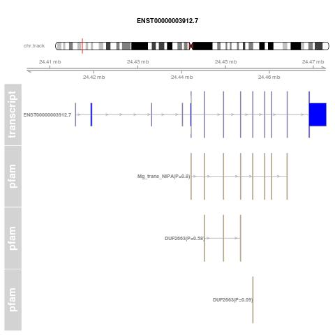

## Transcript Protein Domain Mapper 

Method for retrieving and visualising the protein domains of any protein coding isoform. 

This method extracts the coding sequence (CDS) of any protein coding isoform, and maps it to the protein domain family database [PFAM](http://pfam.xfam.org/). In addition, it outputs a visualisation of the transcript genomic structure together with its corresponding domains. It also enables a joint visualisation of different transcripts which may represent an alternative splicing event. The pipeline is based in [Nextflow](https://www.nextflow.io/), a bioinformatics workflowflow schedueler.

Developed by [**Ruben Chazarra Gil**](https://github.com/rubenchazarra).


### Pipeline inputs

The input files to the method must be specified in the configuration file `nextflow.config`. These are: 
* GTF annotation file  (`params.gtf`)
* List of transcript IDs (`params.transcript_list`): Isoform nomenclature must match that one present in the GTF annotation file. An example of input transcript list can be seen in `test_data/transcript_list.txt`.
* Genome fasta file (`params.genome`)

### Description of the method

The pipeline runs once per transcript, in a parallel manner. For each transcript in the input list the following steps are conducted: 
1. Extraction of the transcript CDS and translation (performed with [gffread](https://github.com/gpertea/gffread))
2. Query the [PFAM](http://pfam.xfam.org/) protein domain family database
3. Map the PFAM alignment coordinates to genomic coordinates
4. Visualisation of the transcript model together with its PFAM alignments ([GViz](https://bioconductor.org/packages/release/bioc/html/Gviz.html))
5. Aggregated visualisation including more than one transcript, which may represent an alternative splicing event. 

### Dependencies

For the successful implementation of the method, a series of tools that have to be installed previously: 

1) **Nextflow**

The pipeline is built in [Nextflow](https://www.nextflow.io/), which can be installed in various ways as described [here](https://www.nextflow.io/docs/latest/getstarted.html)

2) **gffread** 

The tool [gffread](http://ccb.jhu.edu/software/stringtie/gff.shtml#gffread) is used for GFF file processing. We use gffread to extract and translate the CDS from each transcript. 

You can __install gffread__ from its [GitHub repository](https://github.com/gpertea/gffread) or via [conda](https://anaconda.org/bioconda/gffread)

The path to the installation must be specified in the `params.get_cds_translate.gffread` param in the `nextflow.config` file.

3) **PFAM database**

In order to perform a local installation of the PFAM database we first have to install [HMMER](http://hmmer.org/). 

[__How to install HMMER__](http://hmmer.org/documentation.html). 

Then you must add the hmmscan path to `params.pfam.hmmscan` in the `nextflow.config` file.

Then you can download the latest release of the PFAM DB from the [EBI FTP server](http://ftp.ebi.ac.uk/pub/databases/Pfam/releases/). This can be done directly from your terminal as: 

```
wget ftp://ftp.ebi.ac.uk/pub/databases/Pfam/releases/Pfam31.0/Pfam-A.hmm.gz 
gunzip Pfam-A.hmm.gz
hmmpress Pfam-A.hmm
```
The pfam database path must then be added to `params.pfam.pfam_db` in the `nextflow.config` file. Note that the ftp path will have to be changed, to download a different version of the PFAM database 

4) **R Packages** 

The following CRAN and Bioconductor packages must be installed for the pipeline to be functional: 
* [optpartse](https://cran.r-project.org/web/packages/optparse/index.html)
* [Ensembldb](https://bioconductor.org/packages/release/bioc/html/ensembldb.html)
* [EnsDb.Hsapiens.v86](http://bioconductor.org/packages/release/data/annotation/html/EnsDb.Hsapiens.v86.html) [**No longer required**]
* [rtracklayer](https://bioconductor.org/packages/release/bioc/html/rtracklayer.html)
* [Gviz](https://bioconductor.org/packages/release/bioc/html/Gviz.html)
* [readr](https://readr.tidyverse.org/)

#### Fine tunning the pipeline

A pipeline can be tuned by editting a series of parameters in the `nextflow.config` file.

- The `params.run_tag` parameter allows to custom the results directory. By default, the method saves its output in a `results/` directory. If `params.run_tag = 2022-01-01`, the output directory will become `results/2022-01-01`.

- The **significance** of the **global sequence alignment to the PFAM domain** can be controlled via `params.pfam.seq_e_val_thres` parameter. In principle, a sequence E-value << 1 is recommended for significant alignments, although this value may be modified depending on the analysis purposes. A higher E-value threshold will result in a higher number of less significant alignments. Equivalently, the **significance** of the **local sequence alignment to the PFAM domain** can be controlled via  `params.pfam.dom_e_val_thres` parameter.

##### Visualisation step

- To **enable the visualisation steps**, we must specify `params.vis = true`. There are two visualisation steps: the first one generates the transcript model with the corresponding mapped domains (`params.vis_transcript = true`); the second one generates an aggregated visualisation including multiple transcripts ( `params.vis_transcript = false`).

- The **aggregated visualisation step** requires the addition of an aggregation file specifying the transcripts involved. The example aggregation file should look like
```
ENSG00000158122.11;SE:chr9:96641886-96645893:96646024-96651390:-,PRXL2C,96645893,96646024,ENST00000375234.7,ENST00000411939.5
```
- Where the 1st element is the Alternative Splicing Event identifyer (can be any id really), the 2nd element is the gene name, 3rd and 4rth elements are the event coordinates (if not available, we can substitute this numeric values with NULL), and the last elements would be the transcripts implicated in the Alternative Splicing Event. Here you can find an [example aggregation file](tes_data/aggr.csv)

- Finally, If the **visualisation step is enabled**, and in order to include a chromosome diagram in the plot, you should add to the `params.vis.cyto_band` parameter, the table describing the positions of cytogenetic bands wfor each chromosomes. This file can be downloaded [here](https://genome.ucsc.edu/cgi-bin/hgTables?db=hg38&hgta_group=map&hgta_track=cytoBand&hgta_table=cytoBand&hgta_doSchema=describe+table+schema).

### Running the pipeline

The pipeline can be run directly from the commandline as: 

`nextflow run main.nf`

Preferably, you can launch the **Local or Slurm executables**. These contain additional execution parameters (which enable generation of nextflow reports, collection of execution metadata, or resuming previous executions).

Local: 
`./run_AS_Func_Evaluator-LOCAL.sh`

If your infrastructure uses [Slurm](https://slurm.schedmd.com/) workload manager, you can launch the pipeline as: 

`sbatch ./run_AS_Func_Evaluator-SLURM.sh`


### Visualisation examples

#### A) Transcript visualisation

One of the visual outputs of the pipeline is a visualisation of the transcript model with the corresponding mapped protein domains from the pfam database:



#### B) Event (Aggregated) visualisation

As described, the 2nd pipeline output is a visualisation representing various transcripts and their pfam mappings. This may represent an Alternative Splicing Event, as the example below. Here the Event Track represents the Alternative Splicing Event coordinates given in the aggregation file (`params.visualisation.aggregation_csv)`, and we can see the structure and mappings of the `ENST00000375234.7` and `ENST00000411939.5` transcripts.


### Pipeline diagram

This is the flow chart describind the different processes of the pipeline:

**UPDATE**


